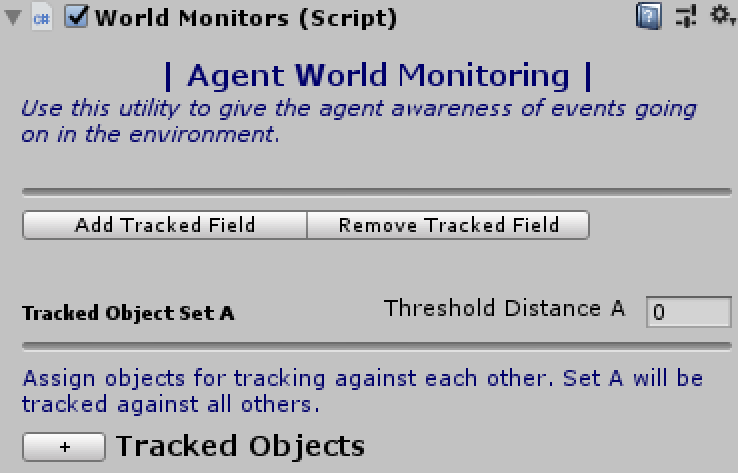
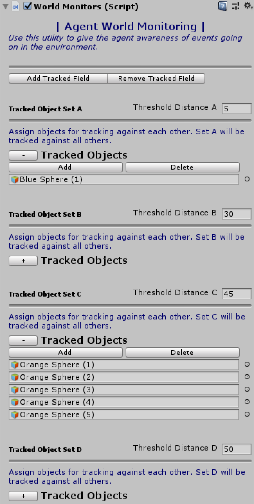
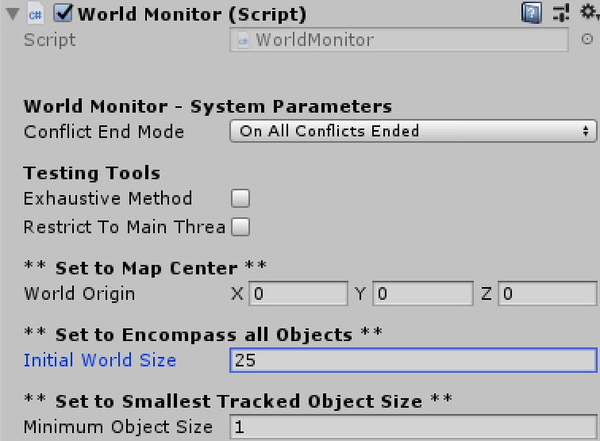
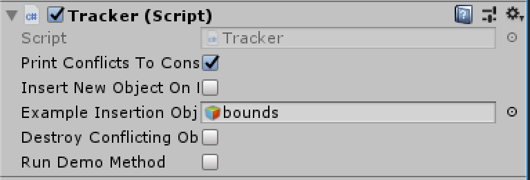
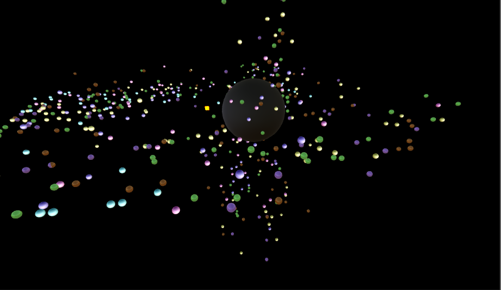
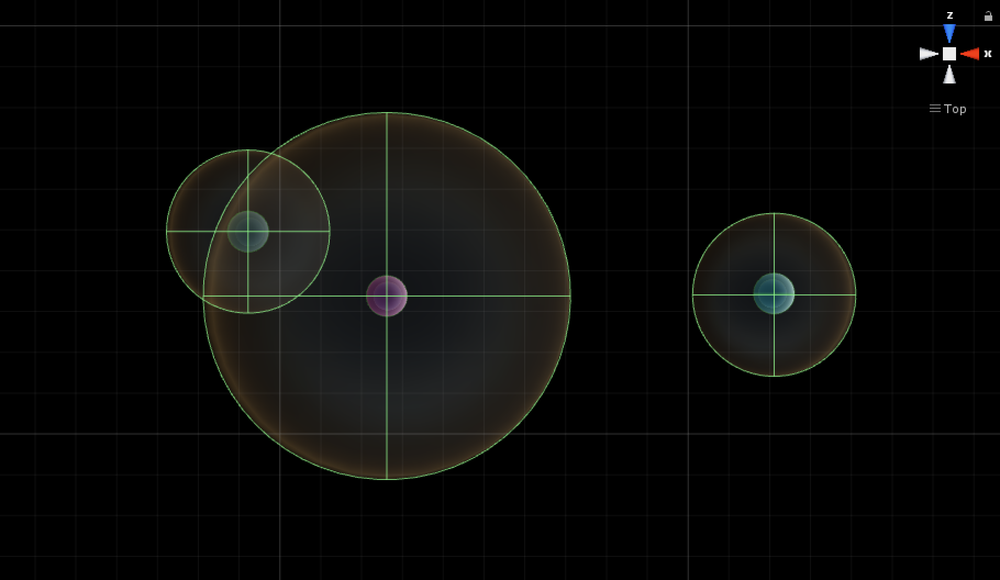

# DynamicObjectTracking

A multithreaded implementation of [Nition's Octree for Unity](https://github.com/Nition/UnityOctree) allowing for discriminatory
object tracking with large numbers of moving GameObjects.

Use of this system is comparable to using trigger colliders with hard coded switch or if else statements, however the objects tracked and
the information receivers are easily selected at your discretion (no sifting through an enormous amount of potential collider data). This
is also a viable option for collision detection if you wish to escape PhysX and spherical colliders can meet your needs.

Any number of agents can track up to 701 classes / fields of objects (a thru zz), and *each field may contain any number of tracked objects*.
Although 701 different fields of tracked objects is likely beyond any need - additional fields can be added at runtime (see public methods).

Every field has its own distance threshold value defining when it registers other tracked objects. Once another tracked object registers,
an event is published to the subscribers (typically an agent or a game manager) monitoring that object. The event publishes the registered 
GameObjects inside the threshold (GameObject[]) and their associated object field types (string[] "a","b","c"...).

# Getting Started

**The Empty WorldMonitors Component**
 
 

 

To start tracking, add a WorldMonitors component as shown above. This component is added to every "tracker" - i.e. a GameObject that will track
the movement of a selected group of GameObjects. The + button will open up the *Tracked Field*, where you can add tracked objects. Add at least 
one more *Tracked Field* (in any instance of WorldMonitors) where the tracked objects will raise conflict with objects in other *Tracked Fields*.

Any number of WorldMonitors can be used. If multiple instances of WorldMonitors will be tracking the same object, that object must appear under
the same field for every instance of WorldMonitors tracking it. See how PinkSphere (1) appears in the following (separate) instances of 
WorldMonitors - it is under "Set B" for each instance. The order of objects in Set B can be different for each WorldMonitors instance.

**Multiple WorldMonitors Instances - Use Symmetrical Fields**
 

 

**The WorldMonitor Component**
 
 

 

If you do not add this component it will be created for you, however you should make a sincere effort to set the parameters beforehand.
Failing to do so can result in an unnecessarily large Octree which can consume resources. Place it on any GameObject you'd like.

This system will *never* use more than one auxilliary thread. If you wish, you may restrict the object tracking to the main thread 
at the expense of performance.

The exhaustive calculation is intended for benchmarking - however if you are using a very small number of tracked objects, exhaustive calculations
may be better for your use case. This method raises the conflict event every frame, as such it's functionality is similar to OnTriggerStay().

# Events

*All events use the ObjectConflictHandler delegate*
  > delegate void ObjectConflictHandler(GameObject objectWithConflict, GameObject[] conflictingObjects, string[] conflictingTypes);

 * **GameObject objectWithConflict:** this is the object who's threshold has been crossed
 * **GameObject[] conflictingObjects:** an array of the objects who've crossed into the threshold
 * **string[] conflictingTypes:** an array of the object field names (e.g. "A", "B", "C" etc)

It is possible for more than one object to cross thresholds during an Update cycle, as such the latter two arguments are arrays.

  > ConflictEnterers(GameObject objectWithConflict, GameObject[] conflictingObjects, string[] conflictingTypes)

Subscribe to this event for notification every time a tracked object enters another's threshold.

  > ConflictLeavers(GameObject objectWithConflict, GameObject[] conflictingObjects, string[] conflictingTypes)
  > ConflictEnd(GameObject objectWithConflict, GameObject[] conflictingObjects, string[] conflictingTypes)

These two events are mutually exclusive; subcribe to ConflictLeavers if you need an update every time an object leaves another's threshold area. 
ConflictEnd is only emitted when *all* tracked objects have vacated a threshold area. 

# Public Methods
  > void ChangeThresholdSize(float threshold, GameObject trackedObject = default(GameObject), string objectType = default(string))

 * **float threshold** the new threshold size you wish to set.
 * **GameObject trackedObject** (optional) the particular tracked object whos threshold you wish to change.
 * **string objectType** (optional) the field name of the threshold you'd like to change

*Remarks: you must include at least one of the optional arguments - - both options change the threshold size for an entire field, not individual objects.*

  > void InsertNewTrackedObject(GameObject trackedObject, WorldMonitors owner, string objectAffiliation, float threshold)

 * **GameObject trackedObject:** the object to be tracked.
 * **WorldMonitors owner:** the WorldMonitors component for the tracker tracking this object.
 * **string objectAffiliation** the type (field name) for this object. This can be anything -- here is where you can expand on the 701 field limit.
 * **float threshold:** the new threshold size you wish to set.

*Remarks: see the example scenes for demonstration of usage.*

  > void RemoveTrackedObject(GameObject trackedObject, WorldMonitors whoToRemove = default(WorldMonitors))

 * **GameObject trackedObject:** the tracked object to be removed.
 * **WorldMonitors whoToRemove:** you can remove individual trackers from tracked objects as they can be tracked by any number of agents

*Remarks: you should always remove the WorldMonitors owner when an agent is destroyed, or at the minimum unsubscribe from the events. see the example scenes for demonstration of usage.*

**Tracker - an Example Object Tracker**
 

 

You will find the Tracker class in the example scenes, which demonstrates how to use all of the public methods except for ChangeThresholdSize().
The last Tracking Agent in the heirarchy (in both scenes) is preconfigured to use some of the options.

## ** Scenes **

# TrackingExample
 

 

TrackingExample demonstrates the system's large scale, dynamic object tracking ability, and an example method is used to change the tracked object's
trajectories when conflicts are incurred by one enabled object (you can enable this behavior in the Tracker inspector). This scene includes
500 initial tracked objects and inflates to 1,500 at runtime. All of these object's conflicts are always known by the agents monitoring them. 
On a SurfaceBook (i7, GTX 1060), this scene runs at 70 fps with the tracking system updating once 1-2 times per 10 frames (note the tracking refresh
rate on smaller scenes is about once/ frame). 

# SmallTrackingExample
 

 

This scene is preconfigured to log events to the console so you can quickly understand how and what data is published.