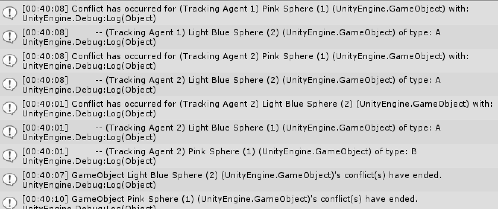

# DynamicObjectTracking

A multithreaded implementation of [Nition's Octree for Unity](https://github.com/Nition/UnityOctree) allowing for discriminatory
object tracking with large numbers of moving objects.

Any number of agents can track up to 26 classes / fields of objects (a thru z), and each field may contain any number of tracked objects.

Every field has its own distance threshold value defining when it registers other tracked objects. Once another tracked object registers,
an event is published to the subscribers (typically an agent or a game manager) monitoring that object. The event publishes the registered 
GameObjects inside the threshold (List<GameObject>) and their associated object field types (List<string> "a","b","c"...).

# Getting Started

**The Empty WorldMonitors Component**
 
 

 

To start tracking, add a WorldMonitors component as shown above. This component is added to every "tracker" - i.e. a GameObject that will track
the movement of a selected group of GameObjects.

Any number of WorldMonitors can be used. If multiple instances of WorldMonitors will be tracking the same object, that object must appear under
the same field for every instance of WorldMonitors tracking it. See how PinkSphere (1) appears in the following (separate) instances of 
WorldMonitors - it is under "Set B" for each instance. The order of objects in Set B and Threshold Distance can be different for each WorldMonitors
instance.

**Multiple WorldMonitors Instances - Use Symmetrical Fields**
 

 

Two example scenes are included. TrackingExample.unity demonstrates the large scale object tracking ability. SmallTrackingExample.unity 
is configured to log events to the console so you can quickly understand what data is published:

 

 

Finally, an exhaustive tracking method is included but is not intended to be used - only to demonstrate the increase in performance for 
discriminatory dynamic object tracking. Some effort could improve the performance of the exhaustive method - however unless you are tracking a 
very small set of objects there is no sense in trying to use it.